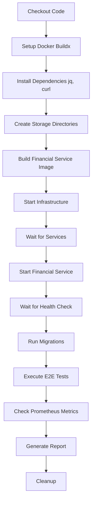

# CI/CD Guide - Microservices Architecture

**Última Atualização**: 2025-10-07  
**Status**: ✅ Implementado e Funcional

---

## 📋 Índice

1. [Visão Geral](#visão-geral)
2. [Workflows Implementados](#workflows-implementados)
3. [Financial Service E2E](#financial-service-e2e)
4. [Microservices E2E Suite](#microservices-e2e-suite)
5. [Triggers e Execução](#triggers-e-execução)
6. [Como Funciona](#como-funciona)
7. [Logs e Debugging](#logs-e-debugging)
8. [Boas Práticas](#boas-práticas)
9. [Troubleshooting](#troubleshooting)

---

## 🎯 Visão Geral

O CI/CD da arquitetura de microserviços está implementado usando **GitHub Actions** e inclui:

- ✅ **Testes Unitários** - Para cada serviço
- ✅ **Testes de Integração** - Validação de banco de dados e APIs
- ✅ **Testes E2E** - Fluxos completos de usuário
- ✅ **Validação Cross-Service** - Comunicação entre serviços
- ✅ **Code Coverage** - Cobertura de código com Xdebug
- ✅ **Docker Integration** - Build e teste de containers

---

## 📦 Workflows Implementados

### Estrutura de Workflows

```
.github/workflows/
├── auth-service-tests.yml              # Unit + Integration (Auth)
├── inventory-service-tests.yml         # Unit + Integration (Inventory)
├── sales-service-tests.yml             # Unit + Integration + Coverage (Sales)
├── financial-service-e2e.yml           # E2E Tests (Financial) ⭐ NOVO
└── microservices-e2e-suite.yml         # Complete E2E Suite ⭐ NOVO
```

---

## 🏦 Financial Service E2E

### Arquivo: `.github/workflows/financial-service-e2e.yml`

**Objetivo**: Executar testes End-to-End completos do Financial Service.

### Etapas do Workflow



### Serviços Iniciados

| Serviço | Container | Porta | Health Check |
|---------|-----------|-------|--------------|
| **Financial Service** | `financial-service` | 9004 | `/health` |
| **PostgreSQL** | `financial-db` | 5432 | `pg_isready` |
| **Redis** | `redis` | 6379 | `redis-cli ping` |
| **RabbitMQ** | `rabbitmq` | 5672 | `rabbitmq-diagnostics ping` |
| **Prometheus** | `prometheus` | 9090 | `/-/healthy` |
| **Grafana** | `grafana` | 3000 | N/A |

### Triggers

```yaml
on:
  push:
    branches: [ main, develop ]
    paths:
      - 'services/financial-service/**'
      - 'scripts/e2e-financial-service.sh'
      - 'docker-compose.yml'
  pull_request:
    branches: [ main, develop ]
```

### O que é Testado

- ✅ **Pre-flight Checks** - Disponibilidade e Prometheus
- ✅ **Health Check** - Status do serviço
- ✅ **Supplier CRUD** - Create, Read, List, Update
- ✅ **Category CRUD** - Create, List, Update, Filter
- ✅ **Accounts Payable Flow** - Create, List, Pay
- ✅ **Accounts Receivable Flow** - Create, List, Receive
- ✅ **Input Validation** - 404, 422 responses
- ✅ **Metrics Validation** - Prometheus integration
- ✅ **Business Rules** - Double payment prevention
- ✅ **Performance** - Response time < 1s

### Tempo de Execução

⏱️ **Total**: ~3-4 minutos
- Build: ~1 min
- Infrastructure startup: ~1 min
- Tests: ~5-10s
- Cleanup: ~30s

---

## 🌐 Microservices E2E Suite

### Arquivo: `.github/workflows/microservices-e2e-suite.yml`

**Objetivo**: Validar toda a arquitetura de microserviços e a comunicação entre serviços.

### Jobs Executados

#### 1. `auth-service-validation`
- Valida endpoints de autenticação
- Testa registro, login, logout
- Verifica JWT tokens

#### 2. `inventory-service-validation`
- Valida gestão de produtos e categorias
- Testa CRUD completo
- Verifica estoque

#### 3. `sales-service-validation`
- Valida pedidos e clientes
- Testa fluxo de vendas
- Integração com Inventory Service

#### 4. `financial-service-e2e`
- Executa suite completa de E2E
- Valida contas a pagar/receber
- Testa integração com Prometheus

#### 5. `integration-test`
- **Teste Cross-Service**
- Valida comunicação entre todos os serviços
- Simula fluxo completo de negócio

#### 6. `summary`
- Gera relatório consolidado
- Mostra status de todos os jobs
- Disponível no GitHub Actions Summary

### Fluxo de Integração Completo

```
1. Auth Service
   └─> Registra usuário
       └─> Retorna TOKEN

2. Inventory Service
   └─> Cria categoria
       └─> Cria produto
           └─> Retorna PRODUCT_ID

3. Sales Service
   └─> Cria cliente
       └─> Cria pedido
           └─> Adiciona item (usa PRODUCT_ID)

4. Financial Service
   └─> Cria fornecedor
       └─> Cria categoria
           └─> Cria conta a pagar
```

### Triggers

```yaml
on:
  push:
    branches: [ main ]
  pull_request:
    branches: [ main ]
  workflow_dispatch:        # Manual trigger
  schedule:
    - cron: '0 3 * * *'     # Daily at 3 AM UTC
```

### Tempo de Execução

⏱️ **Total**: ~15-20 minutos
- Individual validations: 4 jobs × 3 min = 12 min (parallel)
- Integration test: ~3 min
- Summary: ~10s

---

## 🚀 Triggers e Execução

### Quando os Workflows São Executados

#### Automático

1. **Push para `main`/`develop`**
   ```bash
   git push origin main
   ```
   → Executa workflows relevantes baseado nos paths alterados

2. **Pull Request**
   ```bash
   gh pr create --base main --head feature/branch
   ```
   → Executa todos os workflows relevantes

3. **Agendamento (Schedule)**
   - Microservices E2E Suite: Diariamente às 3 AM UTC
   - Útil para detectar regressões

#### Manual

1. **Via GitHub UI**
   - Acesse: Actions → Workflow → Run workflow
   - Selecione branch
   - Click "Run workflow"

2. **Via GitHub CLI**
   ```bash
   gh workflow run "Microservices - Complete E2E Suite"
   ```

---

## 🔍 Como Funciona

### 1. Build & Setup

```yaml
- name: Set up Docker Buildx
  uses: docker/setup-buildx-action@v3

- name: Install dependencies
  run: |
    sudo apt-get update
    sudo apt-get install -y jq curl
```

**Função**: Prepara ambiente com Docker Buildx e dependências necessárias.

### 2. Service Startup

```yaml
- name: Start required services
  run: |
    docker compose up -d redis rabbitmq financial-db prometheus

- name: Wait for services to be healthy
  run: |
    timeout 60 bash -c 'until docker compose exec -T redis redis-cli ping | grep -q PONG; do sleep 1; done'
```

**Função**: Inicia serviços e aguarda até que estejam saudáveis.

### 3. Test Execution

```yaml
- name: Run E2E Tests
  run: |
    chmod +x scripts/e2e-financial-service.sh
    ./scripts/e2e-financial-service.sh
```

**Função**: Executa o script de testes E2E.

### 4. Report Generation

```yaml
- name: Generate E2E Test Report
  if: always()
  run: |
    echo "# E2E Test Report" > $GITHUB_STEP_SUMMARY
    echo "✅ **Status**: PASSED" >> $GITHUB_STEP_SUMMARY
```

**Função**: Cria relatório visual no GitHub Actions.

### 5. Cleanup

```yaml
- name: Cleanup
  if: always()
  run: |
    docker compose down -v
    docker compose rm -f
```

**Função**: Remove todos os containers e volumes.

---

## 📊 Logs e Debugging

### Ver Logs no GitHub Actions

1. **Acesse a execução**
   - GitHub → Actions → Selecione workflow
   - Click no run específico

2. **Expanda os steps**
   - Click em cada step para ver logs
   - Logs coloridos e estruturados

3. **Download de logs**
   - Click no ícone de download no canto superior direito
   - Baixa todos os logs em ZIP

### Logs de Serviços

Os workflows exibem logs dos serviços automaticamente:

```yaml
- name: Display service logs (after tests)
  if: always()
  run: |
    docker compose logs --tail=100 financial-service
    docker compose logs --tail=50 financial-db
```

### Debug Localmente

Para reproduzir o workflow localmente:

```bash
# 1. Limpar ambiente
docker compose down -v

# 2. Iniciar serviços
docker compose up -d redis rabbitmq financial-db prometheus

# 3. Aguardar health checks
timeout 60 bash -c 'until curl -sf http://localhost:9004/health > /dev/null; do sleep 2; done'

# 4. Executar testes
./scripts/e2e-financial-service.sh

# 5. Ver logs se falhar
docker compose logs financial-service
```

---

## ✅ Boas Práticas

### 1. **Paths Filter**

Use `paths` para executar apenas quando necessário:

```yaml
on:
  push:
    paths:
      - 'services/financial-service/**'
      - 'scripts/e2e-financial-service.sh'
```

**Benefício**: Economiza tempo de CI e recursos.

### 2. **Timeouts Adequados**

Configure timeouts para evitar jobs travados:

```yaml
timeout 120 bash -c 'until CONDITION; do sleep 2; done'
```

**Recomendação**:
- Health checks: 60-120s
- Service startup: 120s
- Tests: 300s (5 min)

### 3. **Always Cleanup**

Sempre limpe recursos:

```yaml
- name: Cleanup
  if: always()
  run: docker compose down -v
```

**Benefício**: Evita conflitos entre runs.

### 4. **Cache Dependencies**

Use cache para acelerar:

```yaml
- name: Cache Composer dependencies
  uses: actions/cache@v3
  with:
    path: services/*/vendor
    key: ${{ runner.os }}-composer-${{ hashFiles('**/composer.lock') }}
```

**Benefício**: Reduz tempo de instalação em 50-80%.

### 5. **Test Reports**

Gere relatórios visuais:

```yaml
echo "# Test Report" > $GITHUB_STEP_SUMMARY
echo "✅ All tests passed" >> $GITHUB_STEP_SUMMARY
```

**Benefício**: Visibilidade imediata dos resultados.

---

## 🔧 Troubleshooting

### Problema 1: Timeout nos Health Checks

**Sintoma**:
```
Error: timeout: the monitored command dumped core
```

**Solução**:
1. Aumentar timeout:
   ```yaml
   timeout 180 bash -c 'until CONDITION; do sleep 2; done'
   ```

2. Ver logs do serviço:
   ```yaml
   docker compose logs --tail=100 financial-service
   ```

3. Verificar health check endpoint:
   ```bash
   curl -v http://localhost:9004/health
   ```

### Problema 2: Tests Falhando Localmente mas Passando no CI

**Causa Comum**: Estado inconsistente de containers.

**Solução**:
```bash
# Limpar completamente
docker compose down -v
docker system prune -a -f

# Rebuild images
docker compose build --no-cache

# Reiniciar
docker compose up -d
```

### Problema 3: Metrics Endpoint Não Funciona

**Sintoma**:
```
curl: (7) Failed to connect to localhost port 9004
```

**Solução**:
1. Verificar se Prometheus está configurado:
   ```yaml
   docker compose logs prometheus
   ```

2. Verificar rota do metrics:
   ```php
   // routes/web.php
   Route::get('/metrics', [MetricsController::class, 'index']);
   ```

3. Testar endpoint:
   ```bash
   docker compose exec financial-service curl http://localhost:8000/metrics
   ```

### Problema 4: Database Migration Fails

**Sintoma**:
```
SQLSTATE[08006] Connection refused
```

**Solução**:
1. Verificar se database está ready:
   ```bash
   docker compose exec -T financial-db pg_isready -U financial_user
   ```

2. Aguardar mais tempo:
   ```yaml
   timeout 120 bash -c 'until docker compose exec -T financial-db pg_isready; do sleep 2; done'
   ```

3. Ver logs do PostgreSQL:
   ```bash
   docker compose logs financial-db
   ```

### Problema 5: RabbitMQ Authentication Fails

**Sintoma**:
```
ACCESS_REFUSED - Login was refused
```

**Solução**:
1. Verificar credenciais em `docker-compose.yml`:
   ```yaml
   RABBITMQ_USER: admin
   RABBITMQ_PASSWORD: admin123
   ```

2. Atualizar `rabbitmq/definitions.json`:
   ```bash
   # Gerar novo hash
   echo -n "admin123" | rabbitmq-server rabbitmq_password_hash
   ```

3. Recriar container:
   ```bash
   docker compose up -d --force-recreate rabbitmq
   ```

---

## 📈 Métricas de CI/CD

### Cobertura Atual

| Serviço | Unit Tests | Integration Tests | E2E Tests | Coverage |
|---------|------------|-------------------|-----------|----------|
| **Auth** | ✅ | ✅ | ✅ | N/A |
| **Inventory** | ✅ | ✅ | ✅ | N/A |
| **Sales** | ✅ | ✅ | ✅ | **86%** |
| **Financial** | ✅ | ❌ | ✅ | N/A |

### Tempos Médios de Execução

| Workflow | Tempo Médio | Frequência |
|----------|-------------|------------|
| **Auth Service Tests** | ~2 min | Por commit |
| **Inventory Service Tests** | ~3 min | Por commit |
| **Sales Service Tests** | ~5 min | Por commit |
| **Financial Service E2E** | ~4 min | Por commit |
| **Microservices E2E Suite** | ~18 min | Diário |

---

## 🚀 Próximos Passos

### Melhorias Planejadas

1. **Code Coverage para todos os serviços**
   - Adicionar Xdebug coverage
   - Target: 80% coverage

2. **Performance Tests**
   - Adicionar Apache Bench tests
   - Estabelecer baselines

3. **Security Scanning**
   - Adicionar Snyk/Trivy
   - Scan de vulnerabilidades

4. **Docker Image Scanning**
   - Scan de imagens Docker
   - Análise de CVEs

5. **Deploy Automation**
   - CD para staging
   - CD para production (manual approval)

---

## 📚 Referências

### Workflows
- `.github/workflows/financial-service-e2e.yml`
- `.github/workflows/microservices-e2e-suite.yml`
- `.github/workflows/sales-service-tests.yml`

### Scripts
- `scripts/e2e-financial-service.sh`
- `scripts/validate-auth-service.sh`
- `scripts/validate-inventory-service.sh`
- `scripts/validate-sales-service.sh`
- `scripts/validate-financial-service.sh`

### Documentation
- `E2E-TEST-REPORT.md`
- `VALIDATION-REPORT.md`
- `README.md`

---

## 🎓 Como Contribuir

### Adicionando Novos Testes

1. **Criar script de teste**
   ```bash
   touch scripts/e2e-new-service.sh
   chmod +x scripts/e2e-new-service.sh
   ```

2. **Criar workflow**
   ```yaml
   # .github/workflows/new-service-e2e.yml
   name: New Service - E2E Tests
   on:
     push:
       paths:
         - 'services/new-service/**'
   jobs:
     e2e-tests:
       runs-on: ubuntu-latest
       steps:
         - uses: actions/checkout@v4
         - run: ./scripts/e2e-new-service.sh
   ```

3. **Adicionar ao suite**
   ```yaml
   # .github/workflows/microservices-e2e-suite.yml
   new-service-e2e:
     name: New Service - E2E
     runs-on: ubuntu-latest
     steps:
       - run: ./scripts/e2e-new-service.sh
   ```

4. **Testar localmente**
   ```bash
   ./scripts/e2e-new-service.sh
   ```

5. **Commit e push**
   ```bash
   git add .
   git commit -m "feat: add E2E tests for New Service"
   git push
   ```

---

**Última atualização**: 2025-10-07  
**Autor**: Microservices Team  
**Status**: ✅ Implementado e Testado

